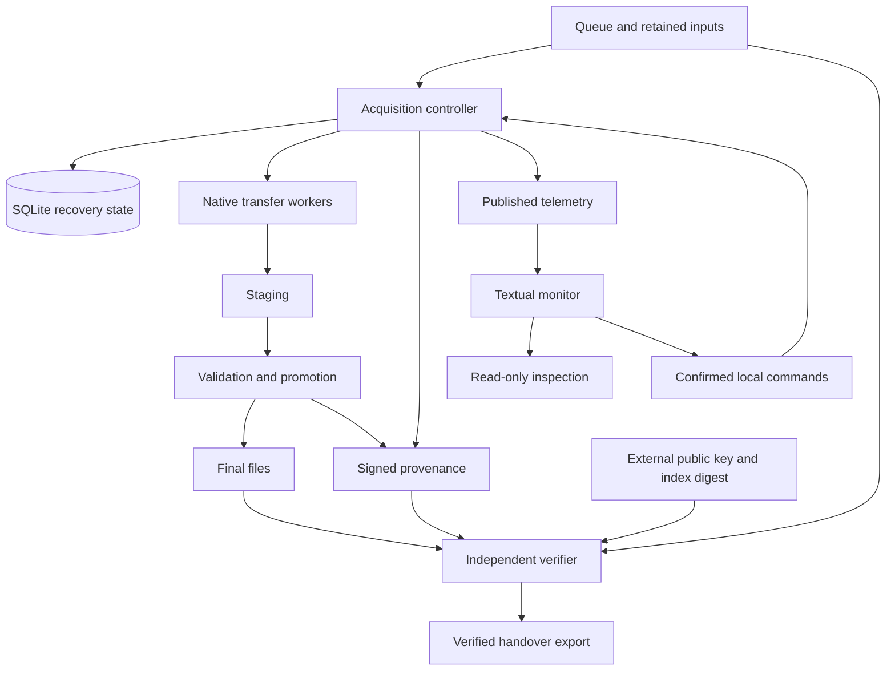

# System architecture

[Documentation](README.md) / Architecture

![TOD-DL: resumable acquisition, durable state, verifiable custody][banner]

TOD-DL separates acquisition authority, operator interaction, and independent
verification. SQLite owns recovery state. Signed artifacts provide the
exportable history. The console observes published state and requests
confirmed actions.

## Component boundaries

The diagram shows the public URL-queue path. Descriptor components have a
separate internal path; their public release gate remains closed.

Telemetry is an observation surface. Inspection serves detailed queries.
Neither gives the monitor direct access to acquisition database writes.

## Ownership map

Start with the owning component when tracing a behavior.

| Concern | Source | Contract |
| --- | --- | --- |
| CLI and lifecycle | [CLI][ref-1], [core][ref-2] | [Acquisition][reliable] |
| Transfer | [Admit][ref-3], [native workers][ref-4] | [Cutover][cutover] |
| Prefix recovery | [Recovery][native-recovery] | [Resume][cutover] |
| Receipt coverage | [Range ledger][native-ranges] | [Body integrity][body] |
| Promotion | [State][ref-5], [storage][ref-6] | [Recovery][recovery] |
| Console and endpoints | [UI][ref-7], [IPC][ref-8] | [Console][console] |
| Signed records | [Provenance][ref-9] | [Custody][custody] |
| Inventory | [Parse][ref-10], [lineage][ref-11] | [Inputs][inventory] |
| Transport | [Routes][ref-12], [inputs][ref-13] | [HTTP][transport] |
| Local evaluation | [Harness][ref-14] | [Evaluation][evaluation] |

The `Downloader` class composes mixins by concern. Read the CLI, the owning
mixin, and its immediate callers together when changing behavior.

## The promotion boundary

Promotion bridges SQLite and the filesystem. The controller records durable
intent before creating the final file. It records durable provenance before
committing completion. An exclusive hard link prevents replacement of an
existing final path.

Recovery checks interrupted promotion against the retained bytes and state.
Uncertainty enters review. The [custody walkthrough](CHAIN-OF-CUSTODY.md)
shows the write order and resulting records.

## The trust boundary

Signed records and recovery state serve different purposes. SQLite enables
continuation after interruption. Signed checkpoints and indexes support
review outside the running controller.

The verifier uses an external public key and trusted run-index digest.
Keeping both beside mutable records would let a replacement record set
supply its own apparent trust. See the [audit guide](AUDIT-RAIL.md).

## The transport boundary

URL queues use native workers and the controller staging sink. Route
selection resolves Tor, direct, or a configured HTTP proxy. HTTP and HTTPS
URL queues use checked response heads. Tor body transfers use isolated child
processes through `torsocks`; an onion host has no direct fallback.

A continuation needs authenticated receipts, a reread prefix, and strong ETag
or trusted-checksum protection. The controller checks the response before
appending bytes. Recovery preserves uncertain suffixes before installing the
authenticated prefix. [Native cutover][cutover] owns these rules.

The active controller refuses retired engines and incompatible schema pins
before runtime writes or source contact. Archived runs need matching retained
builds. Fresh Tor acquisitions passed signed-record and final-file
verification; the [source evidence and handover][native-evidence] record the
scope.
Interrupted source resume and complete native acceptance remain unverified.

Descriptor components use item identities and a separate streaming adapter.
Do not infer public support from an adapter test. `run_locked()` in
[`core.py`](../src/downloader/core.py) rejects format 2 descriptor acquisition.
The [transport contract][transport] and [open work](../specs/OPEN-WORK.md)
define the remaining integration work.

## The observation boundary

The controller publishes telemetry. The console can inspect a run and send
confirmed control requests through authenticated local endpoints. The
controller records accepted decisions and applies their effects.

Tor renewal affects future streams. It does not change an active transfer
or prove that Tor selected a different route. Stop actions and durable item
exclusion have distinct effects described in the [operator guide][ref-15].

## Next steps

Use the [development guide](DEVELOPMENT.md) to select focused tests.
Use the [specification guide](SPECIFICATIONS.md) to trace an exact contract.

[reliable]: ../specs/SPEC-reliable-acquisition.md
[recovery]: ../specs/SPEC-acquisition-fault-recovery.md
[console]: ../specs/SPEC-console-ui.md
[custody]: ../specs/SPEC-run-custody.md
[inventory]: ../specs/SPEC-inventory-snapshot-manifest.md
[transport]: ../specs/SPEC-http-transport.md
[evaluation]: ../specs/SPEC-acquisition-evaluation-infrastructure.md
[banner]: assets/tod-dl-banner-animated.gif

[ref-1]: ../src/tod_dl.py
[ref-2]: ../src/downloader/core.py
[ref-3]: ../src/downloader/admission.py
[ref-4]: ../src/downloader/native_transfer.py
[native-recovery]: ../src/downloader/native_recovery.py
[native-ranges]: ../src/provenance/native_ranges.py
[cutover]: ../specs/SPEC-native-engine-cutover.md
[body]: ../specs/SPEC-response-body-integrity.md
[ref-5]: ../src/downloader/state.py
[ref-6]: ../src/downloader/storage.py
[ref-7]: ../src/console/
[ref-8]: ../src/ipc/
[ref-9]: ../src/provenance/
[ref-10]: ../src/inventory.py
[ref-11]: ../src/provenance/lineage.py
[ref-12]: ../src/routing.py
[ref-13]: ../src/downloader/request_descriptors.py
[ref-14]: ../src/evaluation/
[ref-15]: OPERATOR-GUIDE.md#monitor-and-control-a-run

[native-evidence]: ../specs/reports/native-acquisition-handover-2026-10-01.md
