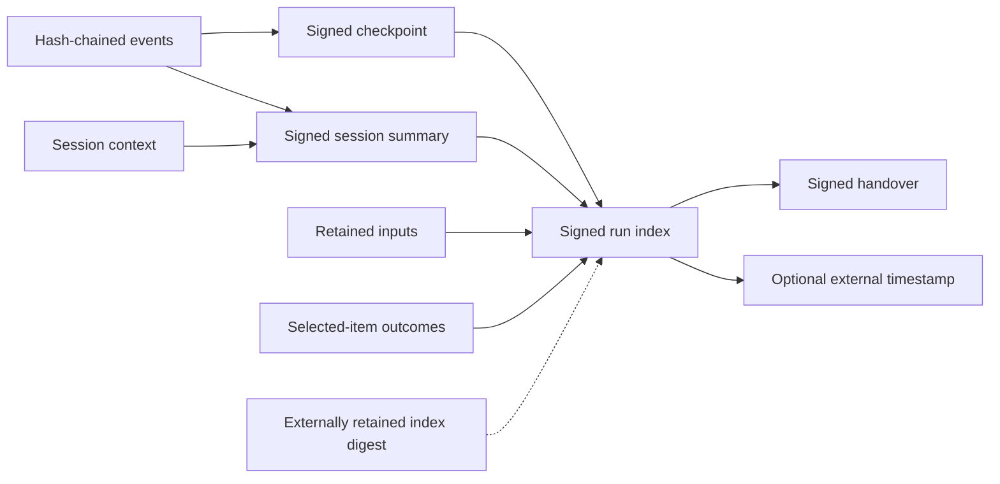

# Audit rail

[Documentation](README.md) / Audit rail

![TOD-DL: resumable acquisition, durable state, verifiable custody][banner]

TOD-DL records what the controller selected, attempted, finalized, and
handed over. Version 2 combines hash-chained events, signed checkpoints,
and signed run indexes. Independent verification checks these artifacts
against retained inputs, final files, and external trust material.

This guide explains the record model. [Run custody][custody] owns the
version 2 contract. [Acquisition provenance][legacy] defines the original
session model. The [operator guide][operate] contains verifier commands.

## Separate the three kinds of state

Each layer answers a different question.

| Layer | Purpose | Authority |
| --- | --- | --- |
| SQLite | Resume and reconcile work | Recovery state |
| Signed artifacts | Authenticate recorded history | External trust required |
| Telemetry and inspection | Explain progress | Read-only state views |

The verifier does not repair recovery state or evidence files. The console
does not write provenance. The controller coordinates durable changes.

## How the signed records connect

A session is one controller start. A run can span several sessions. The
run index binds the sessions and their artifacts into a versioned history.

The diagram summarizes artifact relationships. Exact fields, paths, and
revision rules belong to [run custody][custody] and the
[installed schemas][schemas].

### Events and checkpoints

Events carry their own digest and the previous event's digest. The writer
validates records before appending them. A signed checkpoint authenticates
an exact event prefix, so a crash need not discard all authenticated history.

Events beyond the last authenticated checkpoint remain an unsigned tail.
The verifier reports that boundary. Recovery can append a new account of
interrupted work; it cannot rewrite a past signed artifact.

### Native received-byte coverage

Native range receipts bind received and stored digests to an item, attempt,
and staging generation. Only checkpoint-authenticated receipts can authorize
continuation. The controller rereads the protected prefix before appending.
Finalization checks exact authenticated coverage and rereads each range.
Unsigned suffix bytes remain preserved without received-byte claims.

The [range ledger](../src/provenance/native_ranges.py) checks receipt coverage.
[Native cutover][cutover] owns continuation and recovery rules. These records
do not establish source authenticity or complete native acceptance.

### Session context

Each revised version 2 session records component artifacts, environment,
effective non-secret configuration, validation evidence, and opaque custody
references. Signed records bind the generated context artifact.

The operator supplies a declaration. The controller captures runtime facts
and retains the required artifacts. These are collector assertions: a hash
of an executable does not establish that the host was uncompromised.
[Acquisition context][context] owns the format and validation rules.

### Run indexes and completeness

A signed run index records a revision of the run's history. An externally
retained digest anchors a specific revision and makes rollback before that
anchor detectable.

A complete run accounts for every selected item and verifies every claimed
final. Completeness does not mean every item downloaded successfully. An
outcome can record exclusion, unavailability, review, or failure.

A vanished later revision cannot be detected from an earlier anchor alone.
Retain trusted index digests outside the case tree as part of the operating
procedure.

### Canonical bytes and schema identity

Version 2 uses the JSON Canonicalization Scheme (JCS) implemented in
[`jcs.py`](../src/provenance/jcs.py). The writer chooses the profile through
[`canonical_json_v2`](../src/provenance/__init__.py). Legacy version 1 uses
the separate `legacy-v1` profile.

The [schema registry][registry] owns revision labels and digests.
[Manifest evolution][evolution] owns the evolution contract. Guides must not
copy an active digest that can become stale. Use `schema_record_digest()`
from [`provenance`](../src/provenance/__init__.py) for canonical schema pins.
File-byte digests and canonical record digests serve different purposes.

The active version 2 reader rejects non-active schema digests. Use the matching
retained build for archived records and keep their captured schemas unchanged.
[Native cutover][cutover] owns compatibility refusal for the native release;
the [work register][open-work] lists remaining general schema-policy work.

## What verification establishes

Verification checks the selected scope and reports its limits. Run scope
adds completeness and retained-input checks to session authentication.
Handover scope checks the exported package.

| Check | Evidence used |
| --- | --- |
| Record authenticity | Trusted public key, signature, schema, canonical bytes |
| Event integrity | Sequence, chain, and signed checkpoint or summary |
| Run history | Anchored run index and referenced session artifacts |
| Input identity | Retained input bytes below the artifact root |
| Inventory lineage | Recreated parse report, manifest, queues, and registries |
| Final integrity | Paths, byte counts, and content digests |
| Handover integrity | Signed export, inputs, and final-file manifest |

The [verifier](../src/provenance/verify_provenance.py) remains read-only.
The trusted public key must come from outside the record set. A fingerprint
can pin a supplied key, but cannot replace the key needed for verification.

### Read the result

Run verification distinguishes these outcomes. Consult the command output
for the failed or missing checks.

| Result | Meaning |
| --- | --- |
| `OK` | Anchored revision closed and complete under the selected checks. |
| `INCOMPLETE` | Required evidence is missing or a claim remains unchecked. |
| `FAIL` | A required integrity or semantic check failed. |

`INCOMPLETE` and `FAIL` return nonzero. Preserve the artifacts and investigate
the report. Do not repair a record set to make verification pass.

## Time evidence

Host event times record the host clock. Optional external timestamping binds
a signed run-index revision or handover artifact to a timestamp response.
The verifier checks retained material with external trust configuration and
without network access.

A timestamp does not establish the acquisition start time or validate every
host event time. The [timestamp contract][timestamp] defines policy and
release behavior. The [acceptance report][timestamp-report] uses a local
authority and synthetic certificates; it does not assess a production service.

## Control decisions and sensitive requests

The controller authenticates local control requests and records decisions.
Version 2 can publish signed `control_decision` events through a durable
outbox. The [outbox tests](../tests/test_control_decision_outbox.py) exercise
the boundary between a state change and its signed record.

Normal request records redact sensitive runtime values. Descriptor
components can retain encrypted request evidence in sealed sidecars. A
signed terminal record binds the sidecar's identity and bytes. Public
descriptor acquisition remains blocked, and handover currently omits sealed
sidecars. [Sealed-sidecar export][sealed-export] is planned; the
[multi-recipient contract][sealed-multi] lists implemented components and
their remaining acceptance gaps.

## Trust boundaries that remain

A valid signature answers a narrower question than source authenticity or
complete custody outside the tool.

- A signature identifies a trusted key, not a person.
- A source observation does not establish an original or complete source.
- An external checkpoint cannot expose an unanchored later history that
  disappeared completely.
- Verification checks files when it runs; TOD-DL does not continuously guard
  final files against later modification.
- A recipient receipt needs independently trusted recipient information.
  Without it, acceptance remains unconfirmed.
- Native receipt coverage has implemented code and focused tests. Complete
  native acceptance and the operator pilot remain unverified.
- Remaining body-integrity and preservation profiles do not become available
  merely because the record schema can evolve.

## Next steps

Follow the [chain of custody](CHAIN-OF-CUSTODY.md) for the byte lifecycle.
Use [verification and export commands][operate] for an actual case.
Read [open work][open-work] before treating a planned claim as implemented.

[cutover]: ../specs/SPEC-native-engine-cutover.md
[banner]: assets/tod-dl-banner.gif
[custody]: ../specs/SPEC-run-custody.md
[legacy]: ../specs/SPEC-acquisition-provenance.md
[operate]: OPERATOR-GUIDE.md#verify-provenance
[schemas]: ../src/provenance/schemas/
[registry]: ../src/provenance/schemas/registry.json
[context]: ../specs/SPEC-acquisition-context.md
[evolution]: ../specs/SPEC-manifest-v2-evolution.md
[open-work]: ../specs/OPEN-WORK.md
[timestamp]: ../specs/SPEC-external-timestamping.md
[timestamp-report]: ../specs/reports/external-timestamping-acceptance-2026-09-24.md
[sealed-export]: ../specs/SPEC-sealed-sidecar-handover.md
[sealed-multi]: ../specs/SPEC-sealed-multi-recipient.md
[banner]: assets/tod-dl-banner.svg
