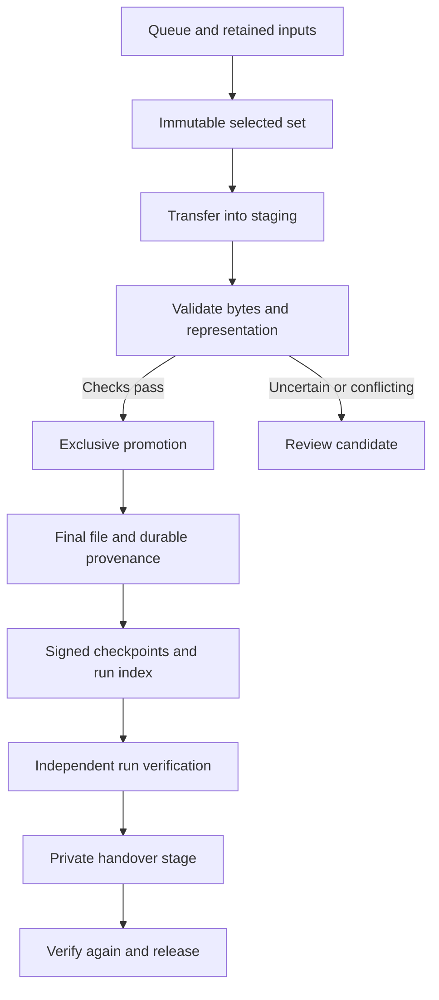
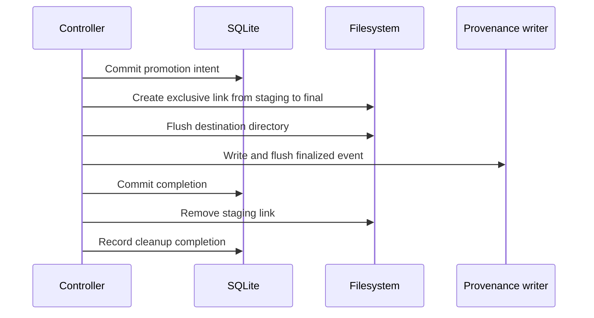

# Chain of custody

[Documentation](README.md) / Chain of custody

![TOD-DL: resumable acquisition, durable state, verifiable custody][banner]

This guide follows selected input through acquisition, recovery,
verification, and handover. TOD-DL records the local acquisition segment.
The operator remains responsible for source authorization, key custody,
and handling after export.

[Run custody][custody] owns the signed-record contract.
[Reliable acquisition][reliable] owns selection and finalization behavior.
The [audit guide](AUDIT-RAIL.md) explains what the records establish.

## Follow the bytes

The diagram shows the public URL-queue path. A review candidate preserves
incoming bytes when automatic finalization cannot proceed safely.

The source is outside this local custody boundary. Successful verification
does not prove that a source file was original or authentic.

## 1. Bind the selected inputs

The operator provides a queue and an explicit `--max-files` value. The
controller binds queue hashes and selection settings to the run ID. Resume
must retain those inputs and the selected set.

Inventory-derived queues can carry lineage from retained snapshots,
policies, and manifests. The verifier can rederive those outputs. A manual
queue remains valid input, but cannot claim inventory lineage.

New version 2 runs use their own state directory. Each session also needs
the context declaration described in the [operator guide][prepare].

## 2. Transfer into staging

Native workers write staged bytes through the controller sink. The controller
checks route requirements and storage admission before starting a transfer. Tor
isolation applies to the configured SocksPort and is checked through the
ControlPort.

An operator stop preserves staged bytes. Native continuation uses only a
checkpoint-authenticated prefix that passes a reread and version-protection
checks. A strong ETag or trusted expected checksum supplies protection; weak
or missing ETags alone cannot. A rejected response head preserves the prefix
and enters review before any append.

[Native cutover][cutover] owns resume eligibility and suffix preservation.
[HTTP transport][transport] owns transport checks. Descriptor extensions use
a separate internal path and remain unavailable through the public CLI.

## 3. Validate before promotion

The controller checks staged content against available size, digest, and
representation evidence. Queue size labels are human estimates; they do
not become expected byte counts.

A failed or uncertain check records a review outcome. Conflicts preserve
incoming bytes under the run's candidate storage. Access-denied outcomes
require an operator decision before a retry.

The [operator guide][review] explains the available review actions. A review
candidate is not a verified final merely because its bytes were retained.

## 4. Cross the filesystem boundary

The core promotion order makes interrupted work recoverable. The sequence
summarizes the public acquisition path; [reliable acquisition][reliable]
defines the full contract.

State and destination must share a filesystem. An existing final cannot be
replaced by the exclusive link. An unsafe path or failed promotion preserves
staged bytes and records the review condition.

A pre-existing final is a separate case. Version 2 distinguishes verified
existing evidence from unchecked or failed existing evidence. File existence
alone does not prove this run acquired it. See [run custody][custody].

## 5. Reconcile interrupted work

Recovery checks durable state and retained bytes before continuing. It
never infers completion solely from a final pathname.

| Interrupted boundary | Recovery question |
| --- | --- |
| Intent exists, final absent | Can staging safely reach the intended path? |
| Final exists, completion absent | Do bytes and recorded intent agree? |
| Event exists, completion absent | Which authenticated records survive? |
| Completion exists, staging remains | Can cleanup preserve the final? |
| Evidence conflicts | Which bytes and facts must remain for review? |

[Fault-recovery requirements][recovery] define the expected actions and
failpoints. [Recovery tests](../tests/test_v2_finalization_recovery.py)
exercise interrupted finalization.

Signed checkpoints authenticate retained event prefixes after an unclean
stop. Events outside an authenticated prefix remain explicitly unverified.
Recovery records do not turn missing evidence into a historical fact.

Native recovery preserves unsigned suffix bytes as candidate evidence before
installing an authenticated prefix. Receipts can cover several attempts in
one staging generation. A replacement generation cannot use earlier receipt
coverage. Live signing repair stops writers before recovery and resumes only
after confirmation. [Native recovery tests][native-tests] check preservation
and replay; the complete acceptance matrix remains unverified.

## 6. Verify a closed run

The operator supplies the trusted public key, externally retained run-index
digest, retained-input root, and final-file directory. The verifier checks
records and bytes without changing them.

Run completeness means every selected item has an accounted outcome. It
does not mean every item completed a download. Follow the [verification
procedure](OPERATOR-GUIDE.md#verify-provenance) and retain the result with
the trust material used for that check.

## 7. Export and release a handover

The exporter creates a private stage from a verified complete run. It copies
retained inputs, run records, and the finals named by the export manifest.
It then verifies the stage before releasing it to a new path.

An interrupted export can resume. Release refuses an existing destination.
Timestamp policy can require valid tokens before release. The receiver
verifies the package using trust material obtained outside that package.

Current handover omits sealed request sidecars. Their inclusion policy and
authorized re-encryption remain separate planned work. A recipient receipt
can record acceptance, but requires independently trusted recipient details.
The [handover commands][handover] describe creation, resume, release, and
recipient verification.

## Operator responsibilities

The software records its own segment of custody. These responsibilities
remain with the operator.

- Keep case data and runtime state outside the source repository.
- Retain signing keys and trust anchors outside the case and export.
- Preserve the exact queue and lineage inputs used by the run.
- Review uncertain outcomes before retrying or excluding items.
- Preserve failed verification evidence for investigation.
- Protect final files after promotion and verify them again before use.
- Record external custody actions in the operator's own custody system.

## Next steps

Use the [operator guide](OPERATOR-GUIDE.md) for commands and prerequisites.
Read the [audit rail](AUDIT-RAIL.md) for authentication and trust limits.

[cutover]: ../specs/SPEC-native-engine-cutover.md
[native-tests]: ../tests/test_native_recovery.py
[banner]: assets/tod-dl-banner.gif
[custody]: ../specs/SPEC-run-custody.md
[reliable]: ../specs/SPEC-reliable-acquisition.md
[transport]: ../specs/SPEC-http-transport.md
[recovery]: ../specs/SPEC-acquisition-fault-recovery.md
[prepare]: OPERATOR-GUIDE.md#prepare-the-case-and-context
[review]: OPERATOR-GUIDE.md#review-a-candidate
[handover]: OPERATOR-GUIDE.md#handover-export
